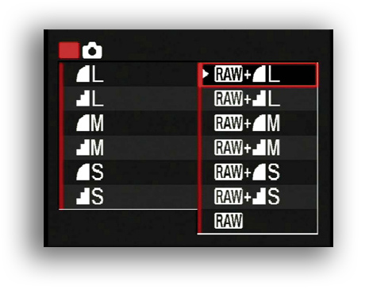

## Golden rule
* ```The more pages you want to capture, the more variables you need to control```
### General rules
* as a rule of thumb, there is no ready-made recipes that apply to everything. Every case deserve different strategies. In our case, our motto was: _the less steps, the better_
* check your electrical power supply
* check the environmental light condition of your room
* check the surround airwaves. As a rule of thumb, _avoid warm and windy environments_. Even more, we close doors and windows to avoid changes in the light's room
* choose the biggest page/book that will be captured in that specific task scanning. Then measure it. Later, weigh it (to avoid a destructive scan)
* choose a _neutral_ glass (non reflective, so there is no translucent backdrops). Avoid anti-glare glass (_aka_ "museum glass"): it blur the images and is prone to get damaged by the same books/pages/fingerprints.
* use gloves in case of historical material (ie.: incunnabilia)
* attach a [color management chart](https://bitbucket.org/imhicihu/incunnabilia-early-book-digitization/issues/29/workflow-color-management-chart)
* attach as a background surface a non-glare / non reflective material (to avoid reflections over images), preferable a dark velvet
* choose your kind of camera: compact, semi-pro, pro. Consider 12 megapixels and above
* avoid any technical change/displacement (even environment condition) during the process of capture. No photo editor will fix that, even with [RAW therapy](Colophon.md) (and lot of man-hours)
* avoid (along the process) use of flash built-in
* avoid use batteries for the camera. If there is no option, consider an extra pack of batteries along the process. _Hint_: plug-in to the AC adapter
* even on compact, semi-pro or pro photographics cameras, choose `auto-focus` feature. 
* on semi-pro or pro cameras, choose the lowest ISO as possible to ensure the least noise in the image
* attach a memory card (minimum: 8Gb, but _the more, the better_). Choose those models with a high ratio of speed recording. Check the free space remaining
* avoid any offer/option/feature of interpolation (by software or hardware)
* Camera options: (if apply)
	* Shutter speed (`1/60th` of a second or higher)
	* White balance: `automatic` in case the light's room is stable along the capture process. `Manual` in stormy or cloudy days or unstable light conditions. Hint: attach a [color management chart](https://bitbucket.org/imhicihu/incunnabilia-early-book-digitization/issues/29/workflow-color-management-chart)
	* Aperture: `5.6` to get clear sharpness
	* [ISO](https://en.wikipedia.org/wiki/Film_speed) (choose the lowest option as possible)
	* Flash (`off` along the process)
	* Avoid any custom image processing (ie.: `sharpening`, `color enhancements`, etc.)
	* Focus (ideally `Autofocus: on`)
	* Exposure compensation (`off` along the process)
	* Zoom (`off` along the process)
	* check the built-in histogram feature (if your camera enable it)
* if compact, choose fast shutterspeed (1/60th of a second or higher) to avoid _blur_.
* avoid glare (between the covering glass and the camera).
* do not attach any [UV filter](https://improvephotography.com/2278/12-photography-myths-every-photographer-should-know/) attached to your camera.
* choose `color` as default to capture the pages.
* choose `RAW` file type as default format to capture 

* choose the best light hours of the day: _morning_. But that variable depends the longitude/latitude of your "darkroom". The same insight goes according if you are in summer or winter
* avoid cloudy, foggy, stormy days. 
* measure room's [lux](https://itunes.apple.com/es/app/light-meter-lux-measurement-tool/id642285909?mt=8)
* avoid artificial light (most of times). But if no choice, choose those that do not generate _saturated_ images, indeed choose those LED models that are energy-efficient. [90 cd](https://en.wikipedia.org/wiki/Candela) is a desirable condition. The lighting should cause minimal glare across all the capture's process
* apply `image rotation`, `cropping`, `keystoning`, `dewarping` or `undeskew` according every page. Avoid any [optical aberrations](https://en.wikipedia.org/wiki/Optical_aberration#Distortion_of_the_image)
* apply [metadata](Metadata.md) to the finished object: apply indexing's standards: [Dublin Core](https://en.wikipedia.org/wiki/Dublin_Core), [XMP](https://en.wikipedia.org/wiki/Extensible_Metadata_Platform) _et alia_
* check the free space remaining of your computer
* consider a version for colorblind persons or those that suffer chromatic symptoms

## To do
* check this snippet => https://bitbucket.org/snippets/imhicihu/GeLn8K/scaling-pdfs
- La apertura, junto con la velocidad del obturador y el nivel ISO, determina la exposición efectiva de la imagen, al determinar la cantidad de luz que alcanza al sensor de la cámara y la sensibilidad del sensor a la luz.
- La apertura, la velocidad del obturador, y el nivel de ISO determinan la exposición
- Distorsión trapezoidal vertical: este efecto se conoce como “keystoning”.
- https://es.wikipedia.org/wiki/Exposici%C3%B3n_%28fotograf%C3%ADa%29
* check this previous issue => https://bitbucket.org/imhicihu/incunnabilia-early-book-digitization/issues/28/workflow-future-processing-procedimiento-a