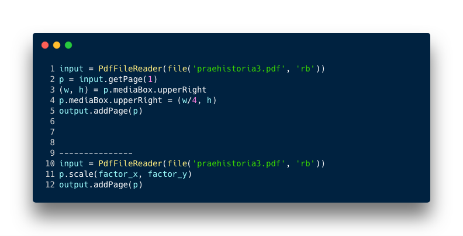

# Rationale #

* Workflow and digital strategies describing the process to migrate analog data to the digital realm
   

   
* This repo is a living document that will grow and adapt over time

### What is this repository for? ###

* Quick summary
     - Good practices plus some workflow enhancements. Essentially, this repo is a massive [_checklist_](Checklist.md).

### How do I get set up? ###

* Summary of set up
     - Verify [checklist.md](Checklist.md)
     - Check [Best practices.md](Best_practices.md)
* Configuration
     - Check [Colophon.md](hColophon.md)
* Dependencies
     - There is no dependencies.
     
### Who do I talk to? ###

* Repo owner or admin
     - Contact to `imhicihu` at `gmail` dot `com`

### Changelog ###

* Please check the [Commits](https://github.com/imhicihu/Digitalizacion-workflow/commits/master) section for the current status

### Code of Conduct

* Please, check our [Code of Conduct](code_of_conduct.md)

### Legal ###

* All trademarks are the property of their respective owners.     

### License ###

* The content of this project itself is licensed under the  